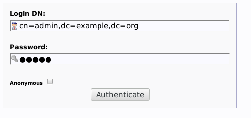
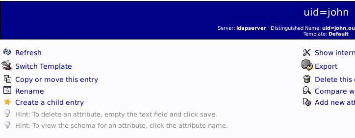
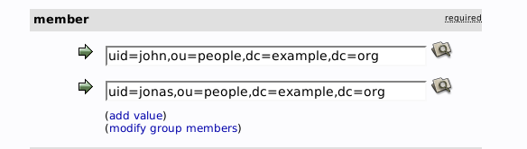
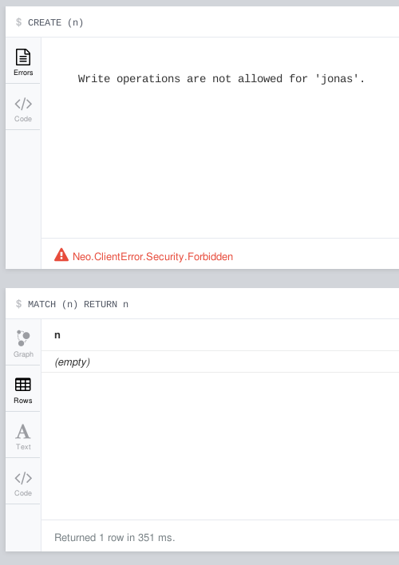
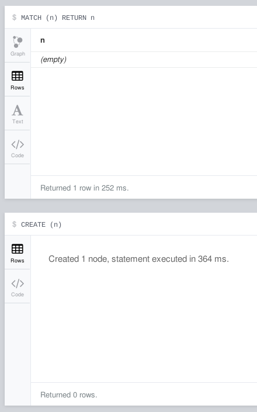

## Pre-requisites

Need to have [Docker][docker] and [docker-compose][compose] installed.

## How to start containers

```shell
docker-compose up --build
```

## Result

You now have a container running [OpenLDAP][openldap] which manages
authentication for the container running Neo4j. You also have a
container running a GUI for managing LDAP users and groups.

* You can access the LDAP interface
  at [https://localhost:6443](https://localhost:6443), and login with
  username `cn=admin,dc=example,dc=org` and password `admin`.



* You can access neo4j as per usual
  at [localhost:7474](http://localhost:7474), with username `john` and
  password `secret`.

## Add another user

In the LDAP GUI, you can add new users easily by clicking "Copy or
move this entry" on an existing user.



## Set the group of user

Go to the group of interest and either add/remove the user from the
member list:



In the images, you can see that `jonas` as well as `john` are members
of this group (which happens to be the `readers` group).

## Example of a read-only user

`jonas` is not a member of any other groups except `readers`, so in
Neo4j, this happens



## Example of a power user

`john` is a member of all groups, so has full access:



[docker]: https://www.docker.com/
[compose]: https://docs.docker.com/compose/
[openldap]: http://www.openldap.org/
